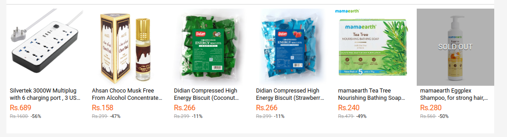

This application can be used to extract meaningful information like product name, price , original price, discount,etc. from a html block of an ecommerce website passed as input to the api.


#### Choice of LLM:
As default LLM, I have used llama3 ( 8 billion parameters of 4.7 gb ). I could have used more powerful llama3 ( 70 billion parameters of 40 gb), but due to having limited RAM size of just 8 gb in my device with no GPU, I could not use the powerful llama 3: 70 billion model.
Regarding use of llama3 rather than phi3, mistral , gemma ,etc. : 
    - I tried using those models too but they didn't extract as relevant info as llama3:8b in most cases and they were hallucinating much in subsequent runs of almost similar prompt.

Note: If there is more RAM/GPU available in your machine you can use more powerful LLMs like llama3:70b (40 gb ) or even try out like phi3:14b ( 7.9 gb )

Also, Since context length of llama3 is 8k ( 8192 ) tokens i.e. input and output tokens combined can have context length of 8192 tokens, I won't recommend to pass longer input prompt since already the input includes the HTML block.

#### Details of API design:
- The API is designed in FastAPI framework, which provides quick and easy way to create api using Python.
- The API has two endpoints:
    - `/api/health` [ GET ] , Used to check if web app is working correctly. Client can make GET request to see if it is being successful to connect to Server.
    - `/api/send_html_encoded` [ POST ], Send html_block of ecommerce site in base64 encoded form , optionally pass one of the available llm locally : `["llama3:8b", "llama3:70b", "phi3:mini", "phi3:medium", "mistral", "gemma:2b", "gemma:7b"]` , optionally pass prompt for extracting the relevant info ( don't include html block here, as it will be concatenated automatically )


##### Note: Why using base64 encoding rather than just directly using copied html block ?
-   Since we need to manually escape all the quotation marks while serializing the html block when passing as request body in JSON in like Postman requests
    which becomes cumbersome, otherwise if escaping not done then serialization fails.
    
    Thus, here the Input html block is passed as base64 encoded from client side, which removes that limitation.


#### Instruction for setting up API and testing locally

1. Go to [Ollama official website](https://ollama.com/) and download for corresponding OS
2. Then make choice of LLM, for now I am using llama3 then I will do `ollama pull llama3` , but if you have more than 40GB available space in RAM/GPU, then use `ollama pull llama3:70b`
3. Then clone this github repo and `cd` into repo
4. Then make python virtualenv :
  `python3 -m venv env` [ for Linux/Unix ]
5. Then install requirements:
  `pip install -r requirements.txt` 
6. Now run server:
  `fastapi dev main.py`
7. Now from postman/thunder client/other , make api request like shown below:
    - GET request in `http://localhost:8000/api/health`, and if 200 status code is returned, then its working properly.
    - Now, copy a html block from any ecommerce site and encode that into base64 form from [like here](https://base64.guru/converter/encode/html)
    - Now make POST request into `http://localhost:8000/api/send_html_encoded` with request body in JSON form as:
    ```
    {
      "html_block": base64_encoded_form_of_html_block,
      "model": [Optional] Default: "llama3:8b" ( Choices are : "llama3:8b", "llama3:70b", "phi3:mini", "phi3:medium", "mistral", "gemma:2b", "gemma:7b")
      "prompt": [Optional] (Don't put html_block in here, only prompt that will be above it.) Default: """Using the given HTML block at the end, extract meaningful information and return in JSON format. And provide the output in JSON format very very strictly."""

    }
    ```
  8. Then processing will take around 4-5 minutes, then output JSON response of extracted data is returned.


#### Examples of input and output:
1. Following is from daraz home page, the corresponding html block of below pic is given below, which is base64 encoded using [this site for now](https://base64.guru/converter/encode/html) ( clients can do base64 encoding using like JS in frontend and then hit api post request )


The corresponding HTML block is: 
```
<div class="card-fs-content">
    <div class="card-fs-content-header J_FSHeader" data-count-down-bg-color="#ff6801" data-count-down-text-color="#ffffff">
    <div class="card-fs-content-header-left J_FSHeaderLeft">
      <div class="card-fs-content-header-left-status pull-left">
        <div class="fs-status-text" style="color: undefined">On Sale Now</div>
      </div>
      <div class="card-fs-content-header-left-timer pull-left">
        <div class="fs-timer-text pull-left" style="color: undefined">Ending in</div>
        <div class="fs-timer-count pull-left" id="hours" style="background-color: #ff6801; color: #ffffff;">14</div>
        <div class="fs-timer-colon pull-left" style="color: #ff6801"> : </div>
        <div class="fs-timer-count pull-left" id="minutes" style="background-color: #ff6801; color: #ffffff;">17</div>
        <div class="fs-timer-colon pull-left" style="color: #ff6801"> : </div>
        <div class="fs-timer-count pull-left" id="seconds" style="background-color: #ff6801; color: #ffffff;">00</div>
      </div>
    </div>
  
      <a class="card-fs-content-button J_ShopMoreBtn" title="Flash Sale" style="color: #f57224; border-color: #f57224" href="//pages.daraz.com.np/wow/i/np/landingpage/flash-sale?scm=1003.4.icms-zebra-100031662-2994316.OTHER_5527396501_2640801&amp;skuIds=129999588,122263843,127897227,127897228,112479575,128365319,127843241">SHOP MORE</a>
    </div>
    <div class="card-fs-content-body J_FSBody" title="Flash Sale">
      
    
    <a href="//www.daraz.com.np/products/silvertek-3000w-multiplug-with-6-charging-port-3-usb-port-c-type-charging-port-i129999588-s1037903378.html" class="card-fs-content-body-unit hp-mod-card-hover J_FSItemUnit">
      <div class="fs-card-img-container">
        
      </div>
      
      <div class="fs-card-text">
        <div class="fs-card-title">Silvertek 3000W Multiplug with 6 charging port , 3 USB Port &amp; C-Type Charging Port</div>
        <div class="fs-card-price">
          <span class="currency">Rs.</span><span class="price">689</span>
        </div>
        <div class="fs-card-origin-price">
          <span class="fs-origin-price">
            <span class="currency">Rs.</span><span class="price">1600</span>
          </span>
          <span class="fs-discount">
           -56%
          </span>
        </div>
        <div class="fs-card-sold">
        
        </div>
      </div>
    </a>
  
    <a href="//www.daraz.com.np/products/ahsan-choco-musk-free-from-alcohol-concentrated-perfume-8ml-i122263843-s1033223318.html" class="card-fs-content-body-unit hp-mod-card-hover J_FSItemUnit">
      <div class="fs-card-img-container">
        
      </div>
      
      <div class="fs-card-text">
        <div class="fs-card-title">Ahsan Choco Musk Free From Alcohol Concentrated Perfume  8ml</div>
        <div class="fs-card-price">
          <span class="currency">Rs.</span><span class="price">158</span>
        </div>
        <div class="fs-card-origin-price">
          <span class="fs-origin-price">
            <span class="currency">Rs.</span><span class="price">299</span>
          </span>
          <span class="fs-discount">
           -47%
          </span>
        </div>
        <div class="fs-card-sold">
        
        </div>
      </div>
    </a>
  
    <a href="//www.daraz.com.np/products/didian-compressed-high-energy-biscuit-coconut-flavor-300-gm-15-gm-x-20-packs-i127897227-s1034906128.html" class="card-fs-content-body-unit hp-mod-card-hover J_FSItemUnit">
      <div class="fs-card-img-container">
        
      </div>
      
      <div class="fs-card-text">
        <div class="fs-card-title">Didian Compressed High Energy Biscuit (Coconut Flavor) - 300 gm (15 gm x 20 packs)</div>
        <div class="fs-card-price">
          <span class="currency">Rs.</span><span class="price">266</span>
        </div>
        <div class="fs-card-origin-price">
          <span class="fs-origin-price">
            <span class="currency">Rs.</span><span class="price">299</span>
          </span>
          <span class="fs-discount">
           -11%
          </span>
        </div>
        <div class="fs-card-sold">
        
        </div>
      </div>
    </a>
  
    <a href="//www.daraz.com.np/products/didian-compressed-high-energy-biscuit-strawberry-milk-flavor-300-gm-15-gm-x-20-packs-i127897228-s1034908129.html" class="card-fs-content-body-unit hp-mod-card-hover J_FSItemUnit">
      <div class="fs-card-img-container">
        
      </div>
      
      <div class="fs-card-text">
        <div class="fs-card-title">Didian Compressed High Energy Biscuit (Strawberry Milk Flavor) - 300 gm (15 gm x 20 packs)</div>
        <div class="fs-card-price">
          <span class="currency">Rs.</span><span class="price">266</span>
        </div>
        <div class="fs-card-origin-price">
          <span class="fs-origin-price">
            <span class="currency">Rs.</span><span class="price">299</span>
          </span>
          <span class="fs-discount">
           -11%
          </span>
        </div>
        <div class="fs-card-sold">
        
        </div>
      </div>
    </a>
  
    <a href="//www.daraz.com.np/products/mamaearth-tea-tree-nourishing-bathing-soap-with-tea-tree-and-neem-for-skin-purification-5x75g-i112479575-s1030431179.html" class="card-fs-content-body-unit hp-mod-card-hover J_FSItemUnit">
      <div class="fs-card-img-container">
        
      </div>
      
      <div class="fs-card-text">
        <div class="fs-card-title">mamaearth Tea Tree Nourishing Bathing Soap With Tea Tree and Neem for Skin Purification - 5x75g</div>
        <div class="fs-card-price">
          <span class="currency">Rs.</span><span class="price">240</span>
        </div>
        <div class="fs-card-origin-price">
          <span class="fs-origin-price">
            <span class="currency">Rs.</span><span class="price">479</span>
          </span>
          <span class="fs-discount">
           -49%
          </span>
        </div>
        <div class="fs-card-sold">
        
        </div>
      </div>
    </a>
  
    <a href="//www.daraz.com.np/products/mamaearth-eggplex-shampoo-for-strong-hair-with-egg-protein-collagen-for-strength-and-shine-250-ml-i128365319-s1035818042.html" class="card-fs-content-body-unit hp-mod-card-hover J_FSItemUnit">
      <div class="fs-card-img-container">
        
      </div>
      <div class="fs-card-img-layer"><span>SOLD OUT</span></div>
      <div class="fs-card-text">
        <div class="fs-card-title">mamaearth Eggplex Shampoo, for strong hair, with Egg Protein &amp; Collagen, for Strength and Shine - 250 ml</div>
        <div class="fs-card-price">
          <span class="currency">Rs.</span><span class="price">280</span>
        </div>
        <div class="fs-card-origin-price">
          <span class="fs-origin-price">
            <span class="currency">Rs.</span><span class="price">560</span>
          </span>
          <span class="fs-discount">
           -50%
          </span>
        </div>
        <div class="fs-card-sold">
        
        </div>
      </div>
    </a>
  </div>
  </div>
```

The input to the api is in following format:
```
{
  "html_block":"PGRpdiBjbGFzcz0iY2FyZC1mcy1jb250ZW50Ij4NCiAgICA8ZGl2IGNsYXNzPSJjYXJkLWZzLW...."
}
# html_block is base64 encoded of the above html block of daraz website. For now I am using default value of 'model' and 'prompt' parameters in input json
```

The extracted output for above case is: 


It takes around 3-5 minutes on average to extract the information


#### Limitations and Future improvements:
- The Xpath of each extracted attribute is not currently supported.
    - Possible solution which happened to some extent as of now is to make a separate call to llm ( for now i experimented with best performing llama3:8b model ), but that caused two separate calls on one api route , which made response to be really slow
    - If I invoke the llm with action of extracting relevant information and their xpaths/css selector in same prompt then the current llama3:8b model is not performing well and only extracting the information not xpath/css selector. This might happen due to being less powerful model so trying out llama3:80b model will definitely improve result.
- If a huge html_block is given, then its not extracting all the products from that. This may be due to limitation in context length of llama3:8b model ,but I really have to experiment and do more research on this to know the exact reason. My hypothesis for now is: May be using llama3:70b model or other model with greater context length will not have this limitation.
